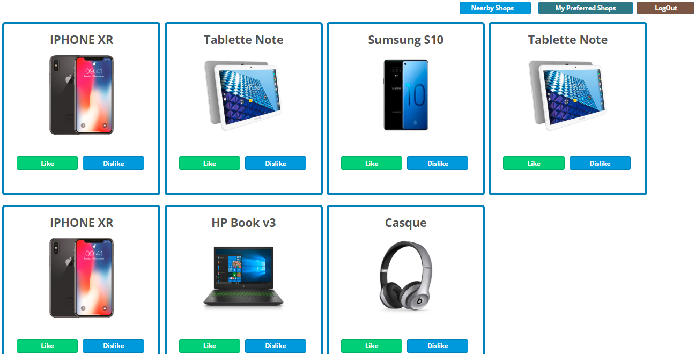

# python-web-application

this project is a web application that is mainly based on python with the flask framework and AJAX / JQuery / CSS / HTML / BD SQLITE

## Flask

Flask is a microframework for Python based on Werkzeug, Jinja 2 and good intentions

## Installation

Use the package manager pip install flask.

```bash
pip install flask
```
# Screnshots
## login


## register


## List of Products



## List of liked products


## Application link deploy on Automation Anywhere

http://amineaounzou1.pythonanywhere.com
